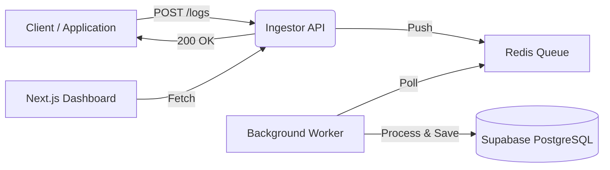

# SysPulse 🚀

**SysPulse** is a scalable, event-driven log ingestion and monitoring system. It is designed to handle high-throughput traffic by decoupling log ingestion from database writing using a **Redis-based Message Queue**.

This project demonstrates a **Microservices-ready** architecture deployed as a cost-optimized "Monolith" to maximize cloud free-tier resources.

---

## 📖 About the Project

In traditional logging systems, writing directly to a database during high traffic can cause bottlenecks and slow down the main application. **SysPulse** solves this by using a **Producer-Consumer** pattern:

1. **Ingestor (Producer):** Accepts logs via HTTP and instantly pushes them to a high-speed Redis Queue. Response time is milliseconds.
2. **Worker (Consumer):** A background process pulls logs from the queue and inserts them into PostgreSQL efficiently.
3. **Visualization:** A real-time dashboard allows users to query and filter logs.

### 🏗️ Architecture



---

## 🛠️ Tech Stack

### Backend
- **Runtime:** Node.js
- **Framework:** Express.js
- **Queue:** Upstash Redis (Serverless)
- **Database:** Supabase PostgreSQL (via Connection Pooler)
- **Process Management:** Custom Child Process spawning (child_process)

### Frontend
- **Framework:** Next.js (App Router)
- **Styling:** Tailwind CSS
- **Icons:** Lucide React
- **State Management:** React Hooks

### DevOps & Deployment
- **Backend Hosting:** Render (Web Service)
- **Frontend Hosting:** Vercel
- **Strategy:** "Monolith" deployment (API + Worker in a single container)

---

## ⚙️ Setup & Configuration

### Prerequisites

Before running the project, ensure you have the following installed or set up:
- Node.js (v18 or higher)
- An Upstash Redis database (for the queue)
- A Supabase PostgreSQL project (for storage)

### Environment Variables

You must configure the environment variables for both the backend and frontend to connect them to your cloud services.

#### 1. Backend Variables

Create a `.env` file in the `server` directory:

```bash
# Server Port
PORT=3000

# Database Connection
# IMPORTANT: Use the Transaction Pooler URL (Port 6543) for IPv4 compatibility on Render
DATABASE_URL= <your Database connection string - PostgreSQL DB preferred>

# Redis Connection
REDIS_URL= < your Redis connection string ( Cloud service o r open source - Redis cloud,Upstash,etc.) >
```

#### 2. Frontend Variables

Create a `.env.local` file in the `client` directory:

```bash
# For local development, it use http://localhost:3000 automatically.
NEXT_PUBLIC_API_URL=https://syspulse-api.onrender.com
```

---

## 🏃‍♂️ Running Locally

To run the full system on your machine, you need to start the Backend (API + Worker) and the Frontend.

### 1. Start the Backend

You need to run the API and the Worker simultaneously.

#### Option A: Separate Terminals (Recommended for debugging)

Open two terminal windows inside the `server` folder:

```bash
# Terminal 1: Starts the API server
npm install
npm run dev

# Terminal 2: Starts the Background Worker
npm run worker
```

#### Option B: Monolith Mode (Simulates Production)

Run both processes in a single terminal using the launcher script:

```bash
cd server
npm start
```

### 2. Start the Frontend

Open a terminal inside the `client` folder:

```bash
cd client
npm install
npm run dev
# The dashboard will open at http://localhost:3001
```

---

## 🔌 API Guide

### Ingest Log

**`POST /logs`**

This endpoint accepts a log entry and pushes it to the Redis queue for asynchronous processing.

#### Request Body:

```json
{
  "service": "payment-gateway",
  "level": "ERROR",
  "message": "Transaction timed out after 3000ms",
  "metadata": {
    "transactionId": "tx_12345",
    "region": "us-east-1"
  }
}
```

#### Response:

```json
{
  "status": "success",
  "message": "Log queued"
}
```

---

## ☁️ Deployment Strategy (The "Free Tier Hack")

To keep this project 100% free on Render, we cannot deploy the API and Worker as separate services (which would double the cost).

Instead, this project uses a **Monolith Strategy:**

1. A "Launcher" script (`server/src/main.js`) is used as the entry point.
2. It uses Node.js `spawn` to launch both `ingestor.js` and `worker.js` as child processes inside the same Docker container.
3. This allows full event-driven functionality within a single cloud instance.

---

## 🔮 Future Enhancements

- [ ] **Rate Limiting:** Implement Redis-based sliding window rate limiting to prevent spam.
- [ ] **WebSockets:** Replace polling on the frontend with Socket.io for true real-time log streaming.
- [ ] **Log Rotation:** Archive old logs to AWS S3 / Supabase Storage to save database space.
- [ ] **Authentication:** Secure the Dashboard with NextAuth.

---

## ⚠️ Status Note

**Service Suspended?** If you see a "Service Temporarily Unavailable" message on the frontend, the backend has been manually suspended to preserve Redis command quotas during inactivity.


